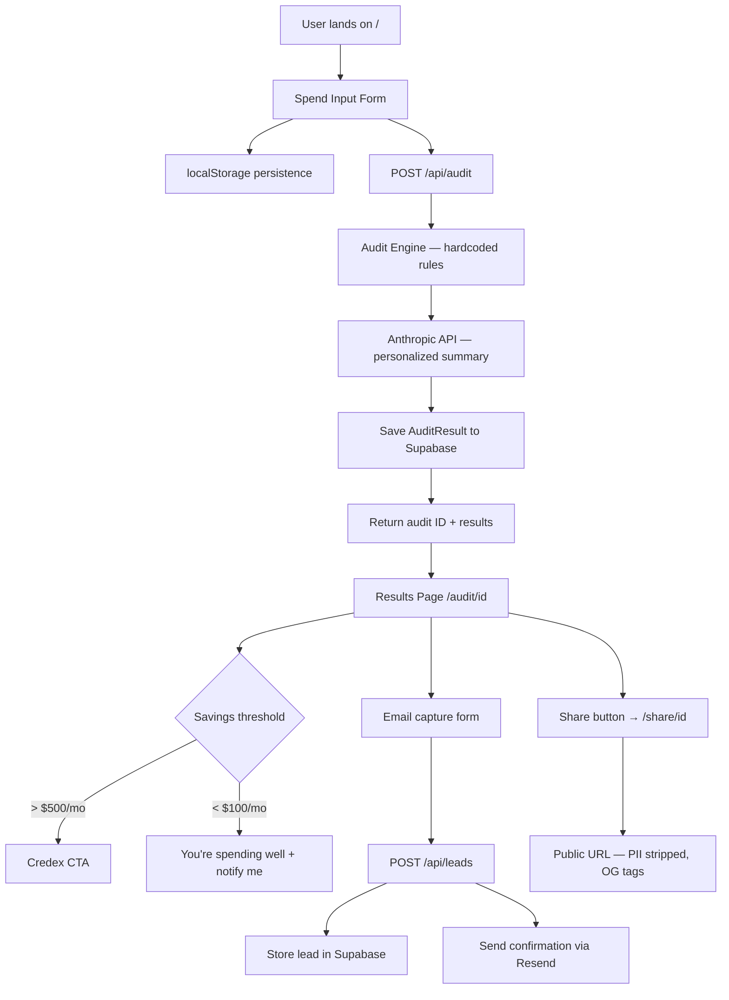

# ARCHITECTURE — AI Spend Audit

## System Diagram

> _Mermaid diagram to be added in Commit 11._

## Stack Justification

> _To be filled in Commit 11._

## Scaling to 10k Audits/Day

> _To be filled in Commit 11._
